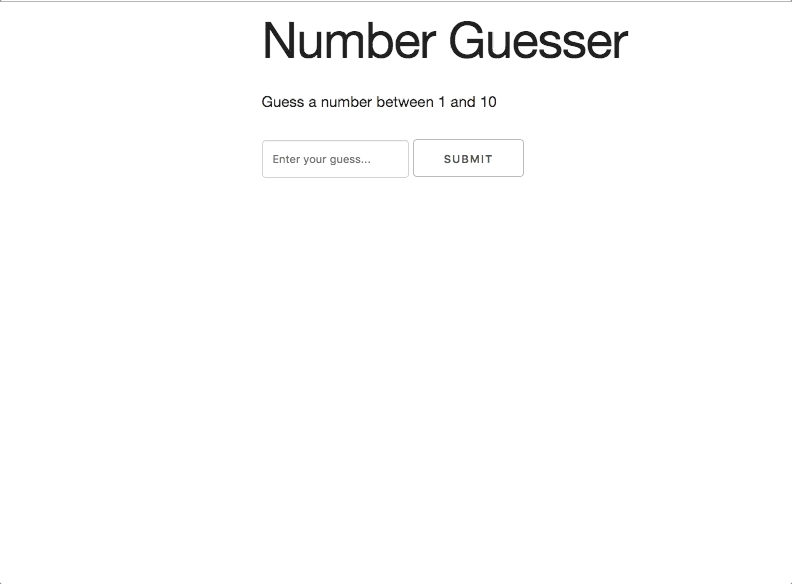

Number Guesser

A simple JavaScript number guesser.

This is a project from Brad Traversy's course on Udemy, "Modern JavaScript From the Beginning." https://www.udemy.com/modern-javascript-from-the-beginning

The purpose of this project is to reinfore the concepts of the DOM (Document Object Model), event listeners, and validation

Skeleton is used for the UI (User Interface). More information can be found at: http://getskeleton.com/

